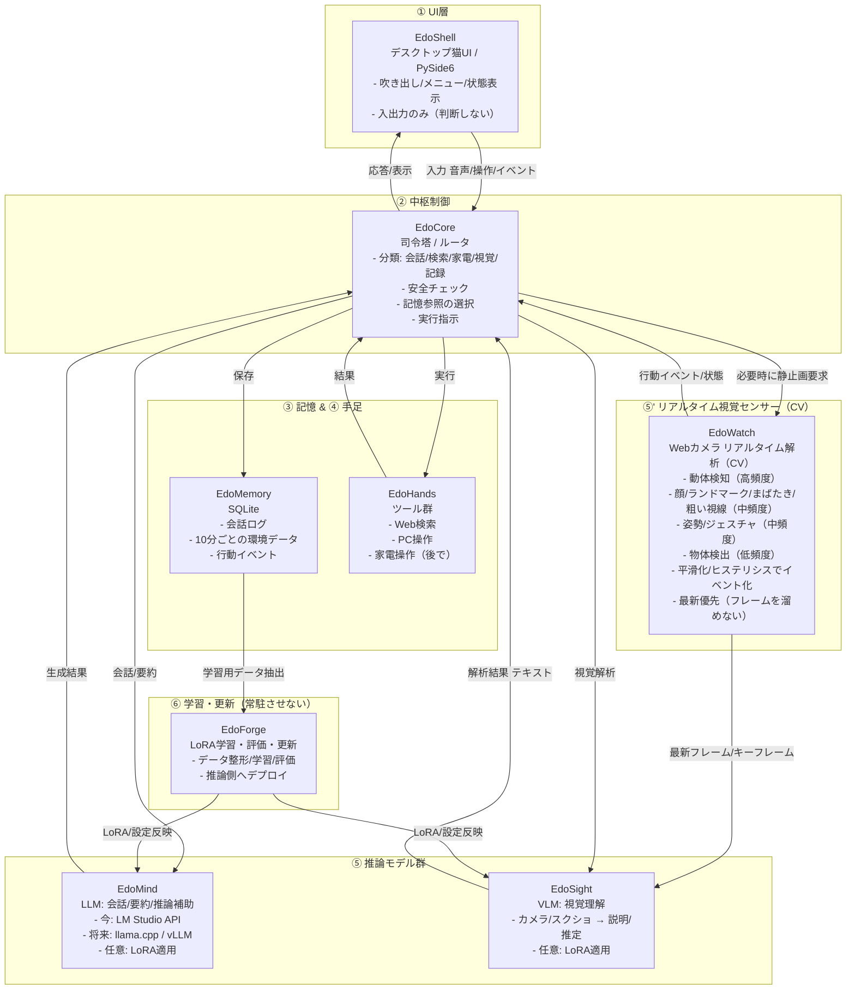

# 猫型AIマスコット（エド）

デスクトップ上で動く猫（PySide6）。日本語で会話し、吹き出しを表示します。右クリックメニューから操作できます。

## 動作環境
- Windows 10/11（他OSは未検証）
- Python 3.10+

## セットアップ
```powershell
py -m pip install --upgrade pip
py -m pip install -r requirements.txt
```
（失敗する場合は `python -m pip ...` に置き換え）

## 起動
起動方法は用途に応じて選べます。

- コンソール非表示（通常利用・推奨 / Windows）

```powershell
pythonw app.pyw
```

- コンソール表示（デバッグ用）

```powershell
py mascot.py
```

エクスプローラから `app.pyw` をダブルクリックしても起動できます。

## 使い方
- 右クリックメニュー
  - 話しかける…: 右下に入力欄を開きます（フォーカス済み）。
  - 設定…: 設定ダイアログを開きます（保存すると即時反映）。
  - 終了: アプリを終了します。
- 入力欄（右下）
  - Enter: 送信、Esc: 閉じる。
  - 依存が入っていればマイクボタン（🎤）で押している間だけ録音→離すと認識送信（任意）。

補足
- チャットモード（`talk.chat_mode: true`）では、吹き出しの代わりに右下のチャットパネルが開き、履歴が見やすくなります。

## 設定（設定… → GUI）
設定ダイアログは `config/mascot.json` の `ui.tabs[].fields[]` を読み、動的に生成されています。保存すると JSON に書き戻され、即再読込されます。

- 主なタブ
  - マスコット: 画像サイズ、更新周期、移動/停止/睡眠、アニメ間隔など
  - 会話: 吹き出しON/OFF、自動発話間隔、メッセージ一覧
  - ネット: 回答最大文字数、タイムアウト
  - LLM: LM Studioのエンドポイント、モデル名、温度、トークン、システムプロンプト

ポイント
- `ui.enforce_all: true` のため、基本は UI 定義の値（各 field の `value`）が読み込み時に実値へ反映されます。
- 時刻の自動付与は無効（`context.include_time=false`）。必要時だけONにしてください。

## LM Studio との連携
- `config/mascot.json` → `llm.enabled` を `true` にする。
- `llm.base_url` に LM Studio の OpenAI 互換URLを設定（例: `http://localhost:1234/v1`）。
- `llm.model` に使用モデル名（例: `LMStudio-openai/gpt-oss-20b`）。
- 会話は日本語・簡潔を前提（EdoMind）。最大文字数は `net.answer_max_chars`（既定: 220）で制御。

## 音声入力（任意）
押している間だけ録音（プッシュトーク）。離すと音声認識→送信します。

依存（任意で導入）:
```powershell
py -m pip install SpeechRecognition sounddevice numpy
```
依存が無い場合はバブルで案内が出ます（通常のテキスト会話はそのまま利用可）。

## 現在の仕様（要点）
- 会話は軽量でシンプル（EdoMind=LM Studio API、RAG/検索＝EdoHandsは未統合）。
- 右クリック「話しかける…」は入力欄を右下に直接表示（サブメニューは廃止）。
- 「入力欄を表示」「右下固定」などの個別メニューは統合/削除済み。
- テストモード/省電力モードは廃止。
- 設定保存時に自動で再読込し、タイマ/アニメ/会話設定を反映。
- UIスレッド以外からのUI操作は行わない（内部シグナルで橋渡し）。
- 司令塔（EdoCore）は現状 `mascot.py` と `talker.py` に内包された最小構成。

## よくある調整
- 返答が長い/短い: `net.answer_max_chars` を変更（例: 180〜260）。
- 口調がブレる: `llm.temperature` を下げる（0.2〜0.5）。
- 遅い: 小さいモデルを選ぶ、`llm.max_tokens` を下げる、`context_turns` を下げる。

## 既知の制限/今後
- LLM は現在時刻/場所を自動では知りません（`context.include_time` をONにすると注入可能）。
- 検索/PC操作/家電操作などのツール（EdoHands）は未統合。必要時のみ実行する構成で追加予定。
- ルーティング/安全確認（EdoCore）は段階的に拡張（分類→実行指示→結果統合）。
- 記憶（EdoMemory）は現状 JSON（`data/memory.json`）ですが、将来は SQLite へ移行予定。
- カメラ情報とVLM（EdoSight）やLoRA 学習（EdoForge）を使い、ユーザーの行動可視化・健康管理・家電操作などを段階的に導入予定。

## 参考（設定ファイルの場所）
- 設定: `config/mascot.json`
- 学習メモリ: `data/memory.json`（将来: SQLite に移行し EdoMemory で管理）

## ログ
- 起動・例外・LLM通信エラーなどは `logs/edo.log` に記録されます（ローテーションあり）。`app.pyw` からの起動でも確認できます。

## 構成（主要ファイル）
- `app.pyw`: ログ初期化＋アプリ起動（通常のエントリポイント）
- `edo_shell.py`: UIシェル（`DesktopMascot` のエイリアス。従来名: `mascot.py`）
- `edo_talker.py`: チャット/吹き出しUI（`Talker` のエイリアス。従来名: `talker.py`）
- `mascot.py`: 互換維持のため残置（内部は `edo_talker` を使用）
- `talker.py`: 互換維持のため残置（`edo_talker.py` から参照可能）
- `agent/llm.py`: LM Studio(OpenAI互換)への問い合わせ（EdoMind）
- `agent/config.py`: 設定の既定値・読み書き
- `agent/memory.py`: 会話履歴・要約等の保存（現状: JSON、将来: EdoMemory/SQLite）
- `config/mascot.json`: 設定と設定UIの定義
- `material/`: アイコンやスプライト素材

## フォルダ構成（現状と将来の指針）

現状（簡素な最小構成）:

```text
E:/edo/
├─ app.pyw                # エントリポイント
├─ mascot.py              # UI本体（EdoShellの中核）
├─ talker.py              # チャット/吹き出し（UI）
├─ edo_shell.py           # エイリアス: DesktopMascot
├─ edo_talker.py          # エイリアス: Talker
├─ agent/                 # 補助モジュール群（暫定的な場所）
│  ├─ config.py           # 設定の既定値と読み書き
│  ├─ llm.py              # LLM連携（EdoMind）
│  ├─ memory.py           # 会話履歴/要約（将来EdoMemoryへ）
│  └─ safety.py           # 簡易セーフティチェック
├─ config/
│  └─ mascot.json         # 設定/設定UI定義
├─ data/
│  └─ memory.json         # 学習メモリ（現状JSON）
└─ material/              # 画像/スプライト素材
```

将来の推奨レイアウト（役割別に整理）:

```text
E:/edo/
├─ app.pyw
├─ ui/                    # EdoShell（UI層）
│  ├─ shell.py           # 旧: mascot.py
│  └─ chat.py            # 旧: talker.py
├─ core/                  # EdoCore（司令塔/ルータ）
│  └─ core.py            # ルーティング/安全/実行指示
├─ mind/                  # EdoMind（LLM）
│  └─ llm.py             # 旧: agent/llm.py
├─ sight/                 # EdoSight（VLM/視覚）
│  └─ …
├─ hands/                 # EdoHands（ツール群）
│  └─ web.py / os.py …
├─ memory/                # EdoMemory（記憶）
│  ├─ store.py           # JSON→SQLite移行予定
│  └─ data/              # DBや永続データ
├─ config/
│  └─ mascot.json
└─ assets/                # 素材（旧: material/）
```

移行は段階的に行えます。まずは `ui/` フォルダを切り出し、`mascot.py` を `ui/shell.py`、`talker.py` を `ui/chat.py` に移す → 既存の `edo_shell.py`/`edo_talker.py` を互換レイヤとして残す、の流れが安全です。

## 開発メモ
- 設定値はコードにハードコードせず、JSONで一元管理（UI定義も同ファイル内）。
- 認識/スレッドからのUI操作はシグナル経由でメインスレッドに委譲しています。
- 将来のコンポーネント構成（EdoShell/EdoCore/EdoMind/EdoHands/EdoSight/EdoMemory/EdoForge）に沿ってファイル分割を進めます（現状は最小構成）。

## アーキテクト設計（将来）


